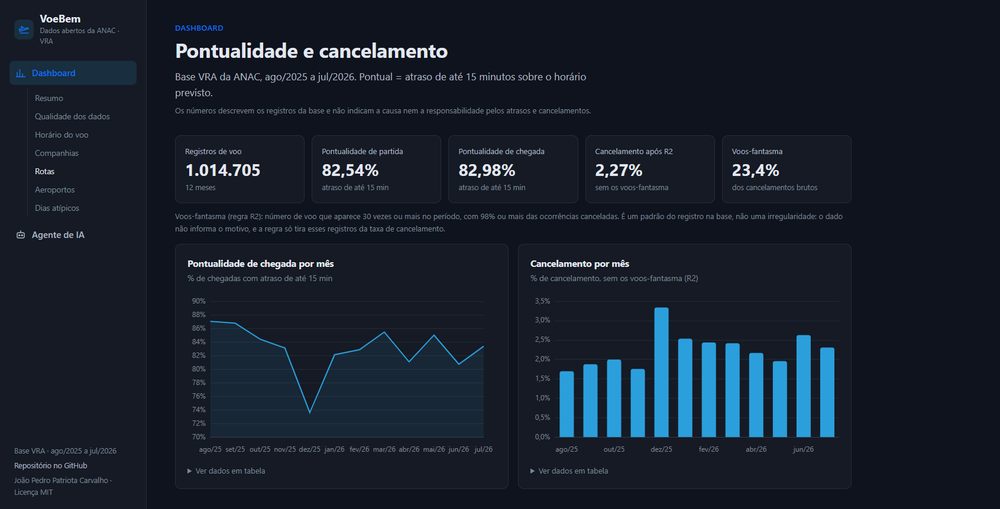
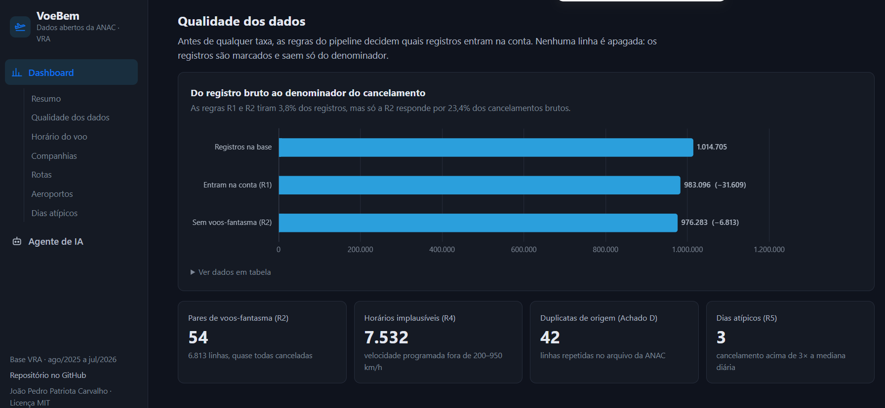
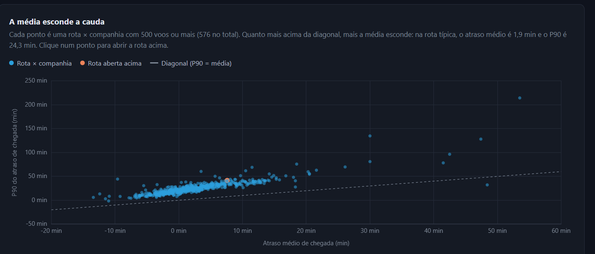
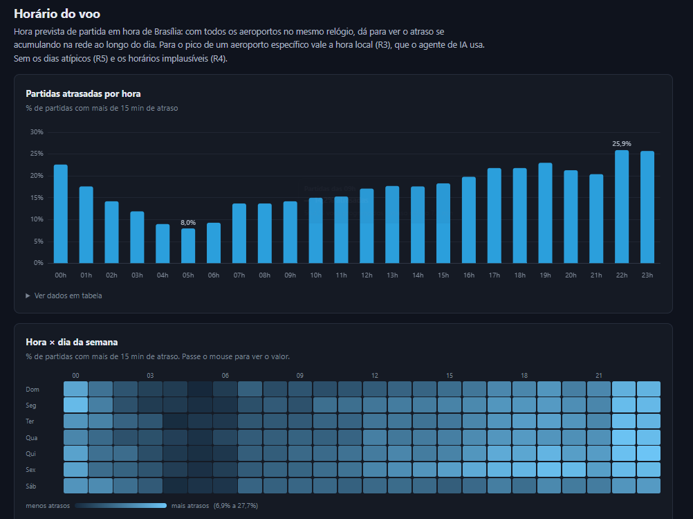
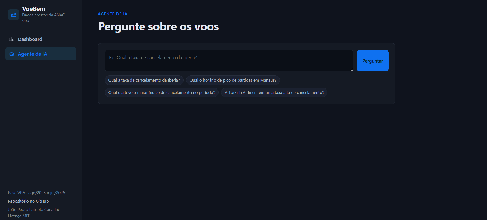

# VoeBem ✈️ — Pontualidade e cancelamento da aviação comercial no Brasil

> Agosto de 2025 a julho de 2026, a partir dos [dados abertos da ANAC](https://www.gov.br/anac/pt-br/acesso-a-informacao/dados-abertos/areas-de-atuacao/voos-e-operacoes-aereas/voo-regular-ativo-vra) (base VRA — Voo Regular Ativo).



▶ **Para ver o projeto:** com o Docker Desktop aberto, rode `docker compose up -d --build --wait` na pasta do projeto e abra http://localhost:8080 (detalhes em [Como Executar](#-como-executar-o-projeto)).

Projeto autoral desenvolvido durante a **Imersão Dados com IA da Alura** por **João Pedro Patriota Carvalho**.

O **VoeBem** mede pontualidade e cancelamento por hora do dia, por aeroporto, por companhia e por rota. Para cada rota × companhia, calcula um índice de confiabilidade (R6) que olha também a cauda do atraso (P90), não só a média.

**Tecnologias:** Databricks (PySpark e Delta Lake) · SQL · MySQL 8.4 · Docker Compose · Nginx · Chart.js · Python · Gemini (google-genai) · pytest

---

## 📊 Principais Achados

1. **A parcela de partidas atrasadas aumenta ao longo do dia.** Ela sobe de **8,0% às 5h** para **25,9% às 22h** (partidas com mais de 15 minutos de atraso, em hora de Brasília, sem os dias atípicos e os horários implausíveis).
2. **Dezembro foi o pior mês.** **73,6%** de pontualidade de chegada (os outros meses ficam entre 80,7% e 87,0%) e **3,34%** de cancelamento. Os dias 10 e 11/12 tiveram os maiores índices de cancelamento do período (17,85% e 14,19%), mas mesmo sem esses dois dias dezembro continua abaixo de todos os outros meses.
3. **Quase um quarto dos cancelamentos vem de 54 números de voo.** **23,4%** dos cancelamentos brutos da base vêm de 54 pares (companhia, número do voo) que aparecem 30 vezes ou mais e são cancelados em 98% ou mais das vezes. O dado não diz por que esses registros existem; a regra R2 os separa para que não pesem na taxa de cancelamento.

## 📌 Nota sobre os Dados

Os números descrevem os registros da [base VRA da ANAC](https://www.gov.br/anac/pt-br/acesso-a-informacao/dados-abertos/areas-de-atuacao/voos-e-operacoes-aereas/voo-regular-ativo-vra) e **não indicam a causa nem a responsabilidade** pelos atrasos e cancelamentos. A base não informa o motivo de cada caso: a coluna de justificativa (`Código Justificativa`) vem vazia em todas as linhas do período. Clima, controle de tráfego, infraestrutura e erro de registro aparecem todos da mesma forma no dado. As regras R2 e R5 só marcam registros e dias fora do padrão, para que eles não distorçam as taxas; elas não apontam o motivo.

---

## 🧭 Visão Geral e Arquitetura

O projeto analisa mais de **1 milhão de registros (1.014.705 registros de voo)** da base VRA (Voo Regular Ativo) da ANAC entre agosto/2025 e julho/2026.

1. **Camada Lakehouse (Databricks):** 3 notebooks (`01_bronze.py`, `02_silver.py`, `03_gold.py`), aplicando 6 regras de negócio fundamentadas em dados.
2. **Camada Relacional & Testes (MySQL 8.4 em Docker):** As 7 tabelas da gold (dimensões e agregados) carregadas e validadas por 18 asserções automatizadas (`sql/03_placar.sql`).
3. **Site (Nginx no Docker):** um único `index.html` com menu à esquerda e 2 páginas (abre no Dashboard):
   - **Dashboard:** resumo, qualidade dos dados, horário do voo, companhias, rotas, aeroportos e dias atípicos, com gráficos (Chart.js, guardado em `assets/`, sem depender de internet).
   - **Agente de IA:** caixa de perguntas com sugestões e a resposta (funciona com o Docker).
4. **Camada de IA:** perguntas em linguagem natural viram Databricks SQL. O código aceita só `SELECT`/`WITH`, bloqueia catálogos de sistema e força `LIMIT 500`; o prompt instrui o modelo a aplicar as regras R1 a R6.

## 🖼️ O Dashboard em Imagens

| Qualidade dos dados | A média esconde a cauda (R6) |
|---|---|
|  |  |

| Horário do voo | Agente de IA |
|---|---|
|  |  |

---

## 🔍 As 6 Regras de Negócio e o Achado D

1. **Denominador Honesto (Regra R1):** só DI 0 (regular) pode ser pontual; só DI 0 e 2 (extra) podem ser cancelados. Saem do denominador de cancelamento 31.609 registros: os demais códigos DI (0,00% de cancelamento em todos) e as duplicatas de origem.
2. **Voos-Fantasma (Regra R2):** 23,4% dos cancelamentos brutos da base vêm de 54 pares (companhia, número do voo) com ≥ 30 ocorrências e ≥ 98% delas canceladas (6.813 linhas; só 2 têm partida real). É um padrão do registro na base, não uma irregularidade: o dado não informa por que esses registros existem, e a regra só os tira da taxa de cancelamento. Com a regra, a taxa da Iberia vai de 54,61% para 6,46%; a da Arajet, de 73,79% para 24,83%.
3. **Hora Local (Regra R3):** os horários do VRA estão em hora de Brasília (UTC−3). A R3 converte para a hora local; 42.235 etapas, que partem dos 34 aeroportos do VRA fora do UTC−3, mudam de hora do dia.
4. **Horários Implausíveis (Regra R4):** 7.532 registros (0,74% da base; 0,94% das etapas com velocidade calculável) com velocidade programada fora de 200–950 km/h, marcados em `suspeita_erro_horario`.
5. **Dias Atípicos (Regra R5):** 3 dias com cancelamento acima de 3 × a mediana diária: **10/12/2025 (17,85%)**, **11/12/2025 (14,19%)** e **30/09/2025 (8,74%)**, contra a mediana nacional de 2,72%.
6. **Variabilidade (Regra R6 - P90 vs Média):** a média esconde a cauda. Na rota SBNF→SBGR da LATAM (TAM), o atraso médio de chegada é 7,6 min e o P90 é 41,4 min (média dos P90 mensais).
7. **Achado D (Silver):** 42 pares (84 linhas) repetidos no VRA bruto (41 idênticos em todas as colunas de negócio), tratados com chave técnica composta (`hash#ocorrencia`).

Os detalhes de cada regra (o SQL e a justificativa) estão nos notebooks, em `notebooks/03_gold.py`.

---

## 🚀 Como Executar o Projeto

### Com Docker (recomendado)

Pré-requisito: [Docker Desktop](https://www.docker.com/products/docker-desktop/) instalado e **aberto** (a baleia na barra de tarefas do Windows precisa estar parada, não animando).

No PowerShell, dentro da pasta do projeto:

```powershell
# 1. Subir tudo: MySQL (com a carga automática dos 7 CSVs) + site + servidor do agente.
#    Na 1ª vez ele baixa as imagens e demora alguns minutos.
docker compose up -d --build --wait

# 2. Abrir no navegador:
#    http://localhost:8080  (abre no Dashboard; o Agente de IA fica no menu da esquerda)

# 3. (opcional) Rodar os 18 testes do banco — todos devem dar PASSA:
docker compose exec mysql sh -c 'mysql -uroot -p$MYSQL_ROOT_PASSWORD -t voebem < /sql/03_placar.sql'

# 4. Desligar (o banco continua guardado para a próxima vez):
docker compose down

#    Desligar e apagar o banco (a próxima subida recarrega tudo do zero):
docker compose down -v
```

MySQL no Workbench ou DBeaver: host `127.0.0.1`, porta `3307`, usuário `root`, senha `voebem`.
É uma senha padrão só de desenvolvimento: a porta fica presa ao `127.0.0.1`, então só o seu computador
conecta no banco. Para usar outra senha, crie um arquivo `.env` na raiz do projeto com
`MYSQL_ROOT_PASSWORD=sua_senha` antes da primeira subida (o `.env` é ignorado pelo Git). Se o banco já
existir, rode `docker compose down -v` para ele ser criado de novo com a senha nova.

> **Só quer ver o dashboard?** Ele lê `dados/painel.json`, não o MySQL. `docker compose up -d web`
> sobe só o site, com uma imagem bem menor (a caixa de perguntas do agente fica indisponível).
>
> O site fica em `127.0.0.1:8080`: só o seu computador consegue abrir, ele não é exposto na rede.

> **Erro `TLS handshake timeout` ao baixar imagem:** é a conexão do seu computador com o Docker Hub,
> não o projeto. Rode o comando de novo; se continuar, reinicie o Docker Desktop (clique direito na
> baleia → *Restart*), desligue VPN/filtro de internet do antivírus ou tente outra rede.

### Sem Docker

Dê duplo clique no `index.html` no Windows Explorer. Ou, com Python,
rode `python -m http.server 8080` na raiz do projeto e abra http://localhost:8080/.

---

## 🤖 Agente de IA (Texto -> SQL com Governança)

O agente converte perguntas em linguagem natural em queries SQL compatíveis com o Databricks SQL Warehouse, com instruções para aplicar as regras R1 a R6.

### Configuração
1. Copie o arquivo de exemplo de variáveis de ambiente:
   ```bash
   cp agente_ia/.env.example agente_ia/.env
   ```
2. Preencha `agente_ia/.env` (esse arquivo é ignorado pelo Git e nunca vai para o GitHub):

   | variável | o que é | onde pegar |
   |---|---|---|
   | `GEMINI_API_KEY` | chave da API do Gemini (o modelo que escreve o SQL) | [Google AI Studio](https://aistudio.google.com/) → *Get API key* (começa com `AIza`) |
   | `DATABRICKS_SERVER_HOSTNAME` | endereço do workspace | Databricks → *SQL Warehouses* → seu warehouse → aba *Connection details* |
   | `DATABRICKS_HTTP_PATH` | qual warehouse executa o SQL | mesma aba (começa com `/sql/1.0/warehouses/`) |
   | `DATABRICKS_TOKEN` | token pessoal de acesso (PAT) | avatar → *Settings* → *Developer* → *Access tokens* → *Generate new token* (começa com `dapi`) |
   | `DATABRICKS_CATALOG` | catálogo do projeto | já vem `voebem` |
   | `GEMINI_MODEL` | modelo que escreve o SQL | já vem `gemini-3.7-flash`; troque só esta linha quando o Google aposentar o modelo |
   | `GEMINI_MODEL_RESERVA` | segunda tentativa, só se o principal der erro temporário (503) | já vem `gemini-3.5-flash` |

   O Gemini só **escreve** o SQL; quem **executa** e devolve o número é o Databricks, porque é lá que
   está a `gold.obt_voos` (1 milhão de linhas, que não vai para o MySQL).

### Executando o Agente

**Pelo site (caixa de perguntas):** com o `.env` preenchido, rode `docker compose up -d --build web api`,
abra http://localhost:8080 e vá em *Agente de IA*. Se mudar o `.env` depois, reinicie o servidor:
`docker compose up -d --force-recreate api`.

Como as chaves ficam protegidas:

- o navegador manda só o texto da pergunta para `/api/perguntar`;
- o nginx (`nginx/voebem.conf`) repassa o pedido para o contêiner `api` (`agente_ia/servidor.py`) pela rede interna do Docker. A porta do `api` não é publicada;
- só o contêiner `api` lê o `.env`. A resposta tem a pergunta, o texto, o SQL e até 50 linhas do resultado, e qualquer trecho igual a uma chave é trocado por `[oculto]` nas mensagens de erro;
- uma pergunta por vez, com no máximo 500 caracteres.

Fora do Docker (duplo clique no `index.html`, ou um site publicado sem esse servidor) a caixa aparece como indisponível e o resto do site funciona igual.

**Pelo terminal (Docker):**
```bash
docker compose run --rm agente "Qual a taxa de cancelamento da Iberia?"
```

**Via Python local (PowerShell):**
```powershell
cd agente_ia
python -m venv .venv
.\.venv\Scripts\Activate.ps1
pip install -r requirements.txt
python agente.py "Qual o horário de pico de partidas em Manaus?"
```

---

## 🧪 Estratégia de Testes (2 Camadas)

*Um teste que sempre dá verde não é um teste, é decoração.* O VoeBem implementa duas camadas independentes de validação:

1. **Camada 1: Testes Unitários e Governança (`pytest`)**
   - Executa sem necessidade de banco nem APIs externas.
   - Testa a higienização do `validar_sql`, injeção forçada de `LIMIT 500`, bloqueio de comandos perigosos e catálogo do sistema.
   - Testa a paridade do JSON embutido com `dados/painel.json`.
   - Testa o servidor da caixa de perguntas (`test_servidor.py`) com um agente falso: validação da pergunta, resposta sem as chaves e erro com a chave escondida.
   - Rodar localmente:
     ```bash
     pip install -r requirements-dev.txt
     pytest -v
     ```

2. **Camada 2: Placar Automatizado do MySQL (18 Asserções)**
   - O MySQL do Docker nasce vazio e carrega as 7 tabelas da gold via `LOAD DATA INFILE` estrito; o placar valida 18 regras de integridade — todas devem dar `PASSA`.
   - Rodar: `docker compose exec mysql sh -c 'mysql -uroot -p$MYSQL_ROOT_PASSWORD -t voebem < /sql/03_placar.sql'`

---

## 📓 Notebooks Databricks

Os notebooks do pipeline Lakehouse estão na pasta `notebooks/`:
- `01_bronze.py`: Ingestão dos CSVs brutos da ANAC em formato Delta.
- `02_silver.py`: tipagem, horários renomeados para hora de Brasília e chave técnica que marca (sem apagar) as linhas repetidas da fonte.
- `03_gold.py`: Aplicação das regras R1 a R6, modelagem analítica e exportação dos agregados.

> **Fonte dos dados brutos:** baixados diretamente dos [Dados Abertos da ANAC — Voo Regular Ativo (VRA)](https://www.gov.br/anac/pt-br/acesso-a-informacao/dados-abertos/areas-de-atuacao/voos-e-operacoes-aereas/voo-regular-ativo-vra), ago/2025 a jul/2026. Por terem mais de 1 milhão de linhas, os arquivos brutos não são versionados no Git.

---

## 📁 Estrutura do Repositório

```text
Imersao_dados_alura/
├── index.html                   (O site: Dashboard e Agente de IA)
├── assets/                      (estilo.css, app.js e chart.umd.min.js — Chart.js 4.4.1, licença MIT)
├── imagens/                     (Prints do dashboard usados neste README)
├── README.md                    (Este documento)
├── LICENSE                      (Licença MIT)
├── docker-compose.yml           (Orquestração do MySQL 8.4, Web Nginx, servidor do agente e Agente)
├── requirements-dev.txt         (Dependências de desenvolvimento e testes)
├── pytest.ini                   (Configuração do runner pytest)
├── .gitattributes               (Garante integridade de quebras de linha e CSVs)
├── .gitignore                   (Proteção de segredos, caches e artefatos)
├── notebooks/                   (01_bronze.py, 02_silver.py, 03_gold.py)
├── sql/
│   ├── schema_mysql.sql         (DDL das 7 tabelas)
│   ├── 01_carga_voebem_PRONTO.sql (Carga dos 7 CSVs via LOAD DATA INFILE)
│   ├── 02_verificacao.sql       (Testes de carga e consultas de análise)
│   └── 03_placar.sql            (Suite com 18 testes automatizados)
├── dados/
│   ├── painel.json              (JSON pré-agregado com dados do dashboard)
│   ├── atualizar_json_embutido.py (Copia o painel.json para dentro do index.html)
│   └── export/                  (Os 7 CSVs da camada Gold prontos para carga)
├── nginx/
│   └── voebem.conf              (Site + repasse de /api/ para o servidor do agente)
├── agente_ia/
│   ├── Dockerfile               (Imagem containerizada do agente Python 3.12)
│   ├── .dockerignore            (Impede que o .env entre na imagem)
│   ├── .env.example             (Modelo das variáveis — copie para .env)
│   ├── requirements.txt         (Dependências pinadas do agente)
│   ├── agente.py                (Agente Texto -> SQL com google-genai)
│   ├── servidor.py              (Servidor da caixa de perguntas do site; só biblioteca padrão)
│   ├── contrato_obt.json        (Contrato das 62 colunas da gold.obt_voos)
│   └── schema_comments.json     (Metadados das tabelas)
└── tests/                       (Suites de testes unitários com pytest)
    ├── test_validar_sql.py
    ├── test_painel_sincronizado.py
    └── test_servidor.py
```

---

## ⚠️ Limitações Conhecidas

1. **Pipeline Lakehouse no Databricks:** Devido à necessidade de Spark Serverless e tabelas Delta em escala de 1M de linhas, os notebooks são executados exclusivamente no ambiente Databricks.
2. **Armazenamento da OBT:** A tabela granular `obt_voos` (1 milhão de linhas) reside no Databricks; o MySQL hospeda as dimensões e tabelas de KPIs agregadas.
3. **Privilégio do Agente de IA:** O agente utiliza token pessoal (PAT) com validação de segurança em nível de aplicação (regex e catálogo restrito). Em ambientes corporativos de produção, deve-se adotar um *Service Principal* com permissões exclusivas de leitura (`GRANT SELECT ON SCHEMA voebem.gold`).
4. **Cópia do JSON no site:** o `index.html` tem uma cópia embutida de `dados/painel.json` para abrir com duplo clique (`file://`). Quando o `painel.json` mudar, rode `python dados/atualizar_json_embutido.py`; o teste `test_painel_sincronizado.py` falha se as duas versões forem diferentes.

---

## 👤 Autor

**João Pedro Patriota Carvalho** — projeto desenvolvido na Imersão Dados com IA da Alura.

[LinkedIn](https://www.linkedin.com/in/-joao-pedro/) · [GitHub](https://github.com/jppatriotacarvalho)
